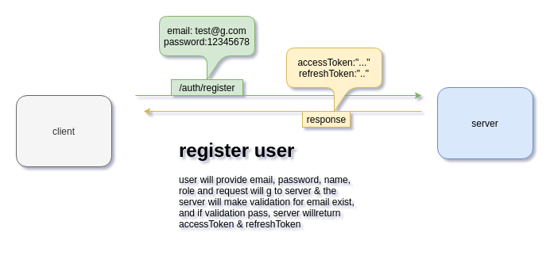
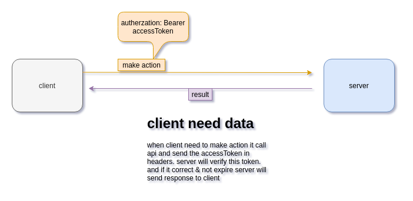

# FATURA | Backend task

This is authorization and authentication that is responsible for registering users to the system, login, and logout out of the system, and responsible add permission to users & roles

## Authentication Phase

How authentication work. i used jwt to auth users, user provide email,password,name and role > the server will validate the body of request then if it pass, server will create record fr this user then create two tokens **accessToken** & **refreshToken** why i used two
type | accessToken | refreshToken |
--- | --- | --- |
expire | 30m | 1week |
used | this used for authenticate for every request he is made | this is used when accessToken expire to get pair of accessToken & refreshToken then ut become in blacklist for secuirty



---

when client need data or want to make an action.
it will make the request & send accessToken in the headers, so server can extract token , verify it if it verified then return result if not return 401



## Installation

to run the app it is very easy, you can use docker-compose to run the app I used docker because I use MySQL as database & Redis for store refresh tokens

**i commit .env file for completeness**

```bash
docker-compose up
```

server will run http://localhost:3000

## Testing

i use jest & supertest run make unit test & write api test
to run tests you can run one of the following commands. but before run these command must install deps & and some some env variables

```bash
npm i
```

```bash
# mysql
- DB_HOST=localhost
- DB_USER=root
- DB_PASSWORD=abc123
- DB_NAME=db
- DB_PORT=3307

# redis
- REDIS_HOST=localhost
- REDIS_PORT=6379
```

then you can run tests commands.

```bash
# run all tests for the whole app
npm run test

# run all tests of auth endpoints
npm run test:auth

# run all tests of product endpoints
npm run test:product
```

## Postman collection

here is postman collection [Postman Collection](https://www.getpostman.com/collections/8481f3e15ddcce98a1d2).
